# Projeto do Curso — DevOps & Cloud

App-base do **Módulo 11 (DevOps & Cloud)** da Capacitação Full Stack.
É a **aplicação-projeto de exemplo** do curso — um rastreador de hábitos bem simples, só pra ter
algo concreto pra levar do *"roda na minha máquina"* até *no ar, versionado, com CI e deploy automático*.
Cada professor pode trocar por seu próprio projeto: o que importa é o fluxo, não o app.

É um frontend **estático** (React + Vite), então não precisa de servidor nem banco:
o navegador guarda tudo. Isso é de propósito — deploy estático no GitHub Pages, custo zero.

---
# Atividade Docker + CI — Rodrigo Matos Gomes

> Preencha todos os campos marcados com `[...]` e substitua os prints de exemplo pelos seus. Salve as imagens em `docs/imagens/` e mantenha os nomes de arquivo indicados.

**Aluno(a):** Rodrigo Matos Gomes  
**Turma:** Vespertino  
**Data:** 26/07/2026 
**Aplicação usada:** docker/getting-started-app — To-Do em Node.js

**Pré-requisitos sobre o app:**
- Runtime/Framework: Node.js 20 (Vite / React Frontend)
- instalação necessária para rodar local: Docker Desktop(Com Docker compose ativo)
- Início: `node src/index.js`("npm run dev -- --host 0.0.0.0 --port 3000")
- Rede do Docker: todo-net
- Porta interna mapeada no host: `3000` (http://localhost:3000)
- Volume de persistência: todo-mysql-data
- Banco de dados: MySQL (v8.0), integrado via variáveis de ambiente (MYSQL_HOST, MYSQL_USER, MYSQL_PASSWORD MYSQL_DB)
- Banco padrão: SQLite (`/etc/todos/todo.db`)
- Banco alternativo: MySQL, via variáveis `MYSQL_HOST`, `MYSQL_USER`, `MYSQL_PASSWORD`, `MYSQL_DB`
- API: `GET /items`, `POST /items`

---

```bash
# Instale o Node 20 (LTS). No WSL/Ubuntu, via nvm (recomendado):
curl -o- https://raw.githubusercontent.com/nvm-sh/nvm/v0.40.1/install.sh | bash
# reabra o terminal, depois:
nvm install 20
nvm use 20

# confira as versões (esperado: node v20.x, npm 10.x)
node -v
npm -v
```

> Alternativa sem nvm: baixe o instalador do Node 20 LTS em https://nodejs.org (traz o npm).
> Use o **20** porque é a versão do CI e do Docker — assim "roda igual" em todo lugar.
---
## 1. Como executar este projeto:

```bash
npm install      # instala as dependências (Vite, React etc) na versão do package-lock — uma vez
npm run dev      # sobe em http://localhost:3000
npm test         # roda os testes (é o que o CI vai checar)
npm run build    # gera os estáticos em dist/

## no terminal com wsl (powershell)
git clone https://github.com/DrigoMatts/my-daily-habits-devops.git  # clonar o repositorio
cd my-daily-habits-devops # para entrar na pasta
docker compose up -d --build # Construir e subir containers (App + MySQL)
docker build -t todo-app:v1 .
docker run -d -p 3000:3000 --name todo todo-app:v1 # mapeamento e rodar
docker images # lista imagens
Acesse: http://localhost:3000
docker compose ps # verificar containers rodando
docker compose logs # ver logs
docker compose down -v # parar e remover a stack com volumes
docker network inspect todo-net # inspecionar a rede criada
```
---

## 2. Imagem e Dockerfile Multi-stage

O `Dockerfile` é **multi-stage**: o estágio 1 compila a app com o Node; o estágio 2
copia só os estáticos pro nginx (imagem final pequena).

Estágios utilizados: Builder (responsável por instalar as dependências e gerar o build estático do Vite com npm run build) e estágio final (servidor de execução enxuto com Nginx/Node para servir os arquivos estáticos compilados).

Imagem base: node:20-alpine (para o build) e Nginx/Alpine (para runtime leve).

Usuário de execução: root configurado explicitamente no Compose (ou usuário não-root node configurado no Dockerfile).

Tamanho final da imagem: Veja o valor exato rodando docker images no seu terminal (geralmente entre 100MB e 180MB).

## Print 1 - Build + Docker

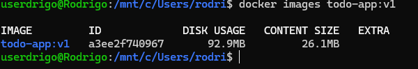


## Print 2 - Aplicação rodando


Por que o multi-stage ajuda?

>> O multi-stage build separa o ambiente de compilação do ambiente de execução, garantindo que código-fonte extra, ferramentas de build e pacotes de desenvolvimento não vão para a imagem final, o que reduz drasticamente seu tamanho e aumenta a segurança do container. 

---

# 3. Volumes e Persistência

Volume Utilizado e Motando em: 

```bash
todo-db/etc/todos
```

## Print 3 - Sem Volume 

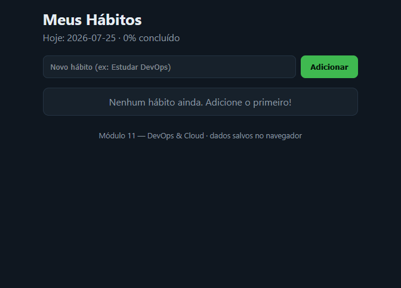

## Print 4 - Com volume

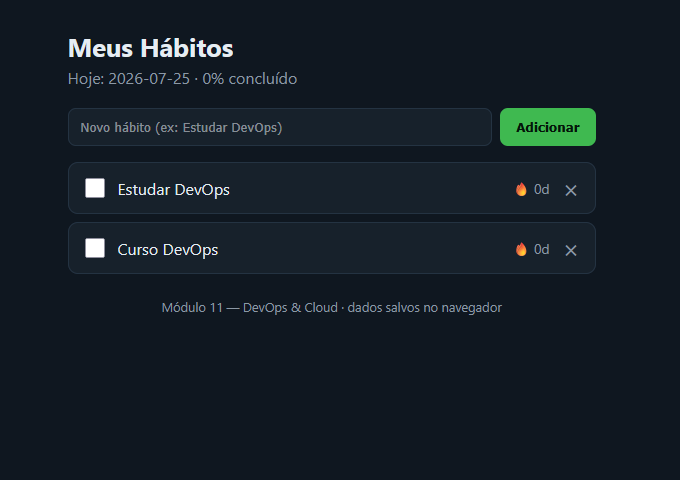


Diferença entre docker compose down e docker compose down -v

---

# 4. Rede

Rede Criada como: **`todo-net`**

### Como funciona a comunicação em rede entre os containers (Docker Network)

Na arquitetura do projeto, a aplicação (container `app`) consegue se comunicar diretamente com o banco de dados (container `db` ou `mysql`) através do recurso de **Redes do Docker** (*Docker Networks*).

#### **Por que o app consegue chamar o host `mysql` (ou `db`) sem saber o IP dele?**

1. **DNS Embutido do Docker (Service Discovery):**
   Quando conectamos containers a uma rede personalizada (seja criada via `docker network create` ou automaticamente pelo `docker compose`), o Docker habilita um **servidor DNS interno**.
   
2. **Resolução de Nomes por Alias/Serviço:**
   Esse DNS mapeia automaticamente o nome do serviço ou alias da rede (ex: `mysql` ou `db`) para o endereço IP interno atual atribuído ao container do banco na rede privada. 

3. **Comunicação Segura e Isolada:**
   * A aplicação não precisa hardcodar um endereço IP estático, que poderia mudar a cada reinicialização dos containers.
   * O banco de dados fica isolado na rede interna do Docker (`todo-net`), sem precisar expor a sua porta padrão (`3306`) diretamente para a máquina host, aumentando a segurança da aplicação.

## Print 5 - Docker Network

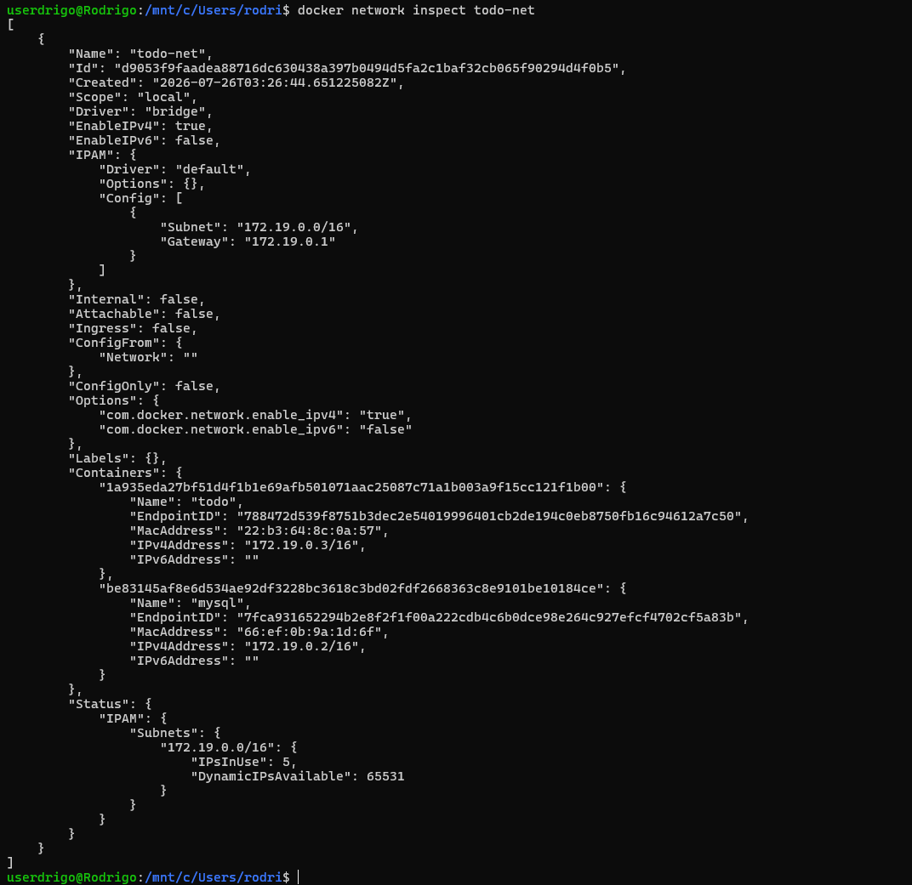

## Print 6 -Dados dentro do MySQL

>> **select * from todo_items; dentro do MySQL:**

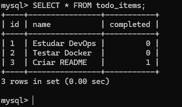


---

# 5. Docker Compose

>> O comando docker compose down apenas remove os containers e redes mantendo os volumes de dados intactos, enquanto o docker compose down -v remove também todos os volumes associados, apagando permanentemente os dados persistidos pelo banco. 

**Testes de Persistência**

## Print 7 

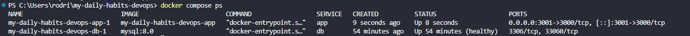

## Print 8 

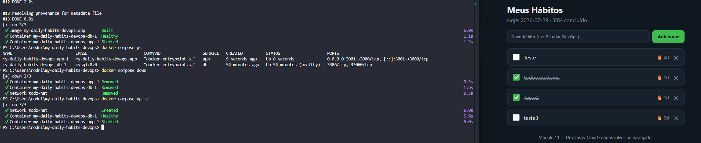

## Print 9

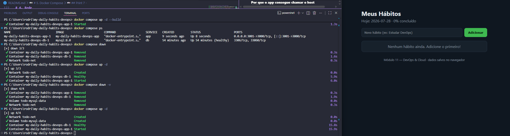

---

# 6. Integração Contínua (Github Actions)

**Arquivo do workflow:** `.github/workflows/ci.yml`

**Gatilhos:** `push` e `pull_request`

**O que o pipeline faz:**

1. **Valida a sintaxe do arquivo de orquestração:** Executa `docker compose config` para garantir que a estrutura e as chaves do `compose.yaml` estejam corretas.
2. **Builda a imagem da aplicação:** Constrói a imagem Docker do serviço `app` a partir das instruções do `Dockerfile`.
3. **Sobe a stack de serviços:** Executa `docker compose up -d` para inicializar em segundo plano o container do banco de dados (`db`) e a aplicação (`app`).
4. **Valida o funcionamento e testa a API:** Aguarda o container estar saudável/pronto para requisições e executa um *smoke test* simulando operações de CRUD via HTTP/API.
5. **Limpa o ambiente:** Executa `docker compose down -v` para derrubar a stack e remover os volumes criados, garantindo um ambiente limpo para as próximas execuções.

### Print 10 — execução verde ✅

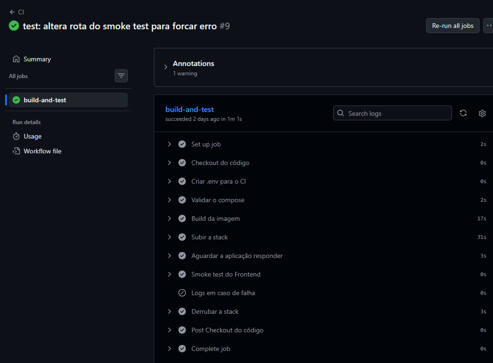

---

# 7. Quebra proposital do CI

**O que eu quebrei:** Alterei o comando de inicialização `CMD` no `Dockerfile` para apontar para um arquivo inexistente (`src/indexx.js` ao invés de `src/index.js`).

**Erro que apareceu no log:** `Error: Cannot find module '/app/src/indexx.js`
(o runtime do Node.js interrompeu o processo com falha ao tentar localizar o script de entrada).

**Como o CI reagiu:** O container da aplicação falhou imediatamente ao tentar subir. Como resultado, a etapa *"Aguardar a aplicação responder"* estourou por *timeout* ao tentar acessar a API sem sucesso, interrompendo a execução do pipeline com status de falha ❌ (status vermelho).

**Como eu corrigi:** Ajustei o caminho do arquivo no parâmetro `CMD` do `Dockerfile` de volta para `src/index.js`, fiz o commit e dei o push na mesma branch (`quebra-proposital`), o que fez o workflow reexecutar e passar com sucesso ✅.

---

### Print 11 — execução vermelha ❌ + log do erro

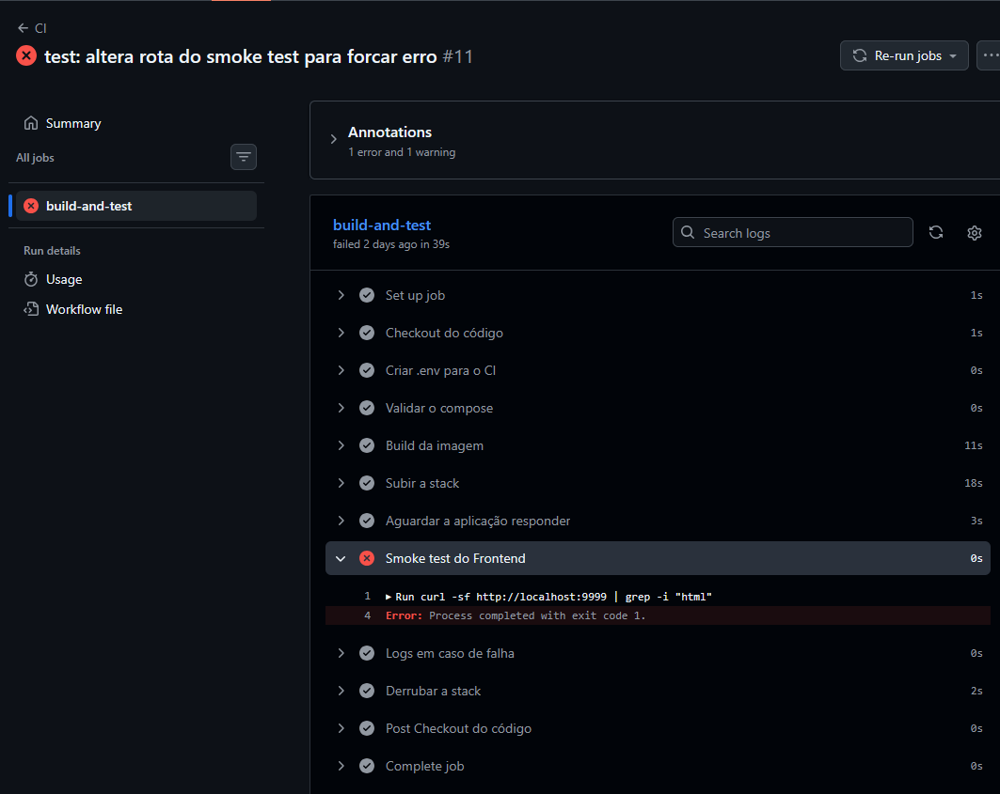

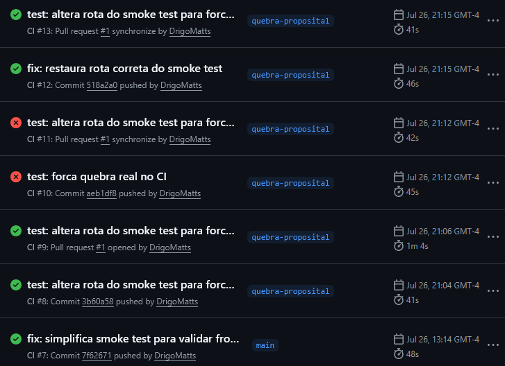

---

## 8. Dificuldades e aprendizados

A experiência prática ao longo de todo o fluxo me deu uma visão clara do ciclo de vida DevOps, desde a conteinerização até a automação do CI. Com certeza vou aplicar esses conhecimentos nos meus próximos projetos. O projeto permitiu consolidar conceitos fundamentais de Docker, redes e integração contínua. Foi uma boa oportunidade para vivenciar a rotina DevOps e absorver práticas.

---

## 9. Checklist de AutoAvaliação

- [x] O `Dockerfile` utiliza uma imagem base oficial e adequada.
- [x] O build da aplicação foi gerado com sucesso sem erros.
- [x] Foi criada e testada uma imagem funcional e otimizada.
- [x] A rede customizada (`todo-net`) foi criada explicitamente.
- [x] O container do app se comunica com o MySQL usando o nome do serviço (DNS interno).
- [x] Os dados cadastrados na aplicação foram verificados diretamente no MySQL via `SELECT`.
- [x] O arquivo `compose.yaml` roda a aplicação e o banco com um único comando (`docker compose up -d`).
- [x] A porta do banco de dados **não** está exposta para o host (acesso isolado).
- [x] Foram configurados `healthcheck` no banco e `depends_on` com `service_healthy` no app.
- [x] Variáveis sensíveis foram gerenciadas via arquivo `.env` (não versionado) e disponibilizado um `.env.example`.
- [x] **Teste de persistência validadas:** `docker compose down` mantém os dados e `docker compose down -v` limpa os dados do volume.
- [x] O workflow do GitHub Actions em `.github/workflows/ci.yml` executa automaticamente nos eventos de `push` e `pull_request`.
- [x] O pipeline passa por todas as etapas (validação do compose, build, subir stack, smoke test e cleanup).
- [x] **Teste de quebra proposital:** A quebra intencional foi realizada em uma branch isolada (`quebra-proposital`) e gerou o log vermelho ❌ no CI.
- [x] O erro foi corrigido na mesma branch, fazendo o pipeline passar para verde ✅ e finalizando com o Merge no Pull Request.


## CD — Publicação no Docker Hub (EXTRA)

**Print 1 — token criado no Docker Hub** 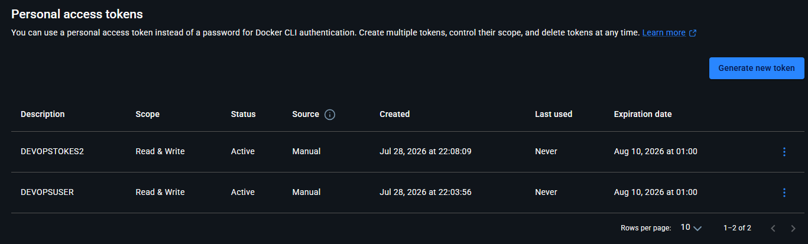

**Print 2 — Secrets cadastrados no GitHub (DOCKERHUB_USERNAME e DOCKERHUB_TOKEN)** 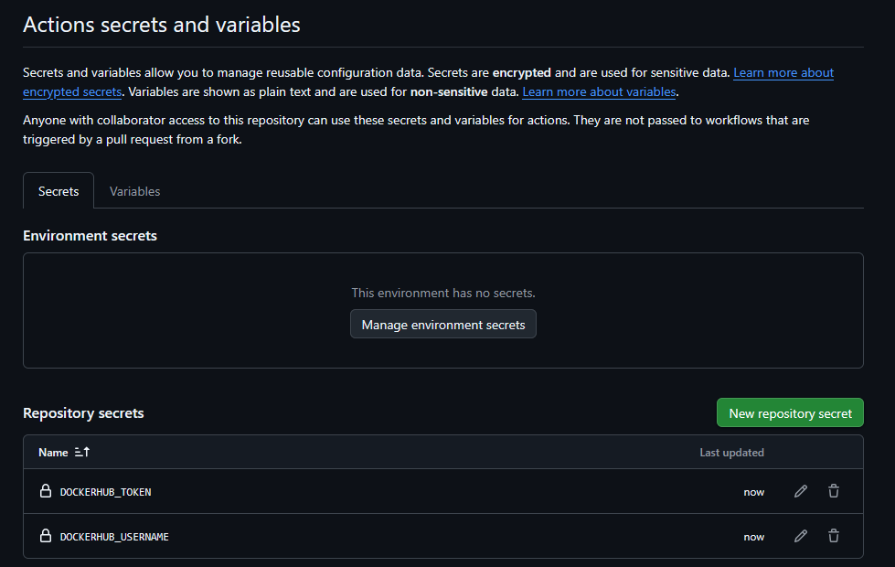

**Print 3 — workflow de CD verde na aba Actions** [cole o print aqui]

**Print 4 — imagem publicada no Docker Hub** [cole o print aqui]

**Print 5 — docker pull baixando a imagem publicada** [cole o print aqui]

### Respostas

1. **O que é o Docker Hub?**
   É um repositório público e privado em nuvem mantido pela Docker para armazenar, compartilhar e gerenciar imagens de contêineres.

2. **Diferença entre CI e CD:**
   * **CI (Continuous Integration / Integração Contínua):** É a prática de automatizar a compilação, testes e validação do código sempre que novos trechos são enviados ao repositório, garantindo a qualidade do sistema.
   * **CD (Continuous Delivery ou Continuous Deployment / Entrega ou Implantação Contínua):** É a automação do processo de empacotamento, publicação e disponibilização da aplicação pronta para uso em um registro (como o Docker Hub) ou diretamente no ambiente de produção.

3. **Por que usar token e Secrets em vez de escrever usuário e senha no `cd.yml`:**
   Por questões de segurança. O arquivo `cd.yml` fica visível no histórico do repositório, e expor senhas diretamente em código (hardcoded) gera graves vazamentos. O uso de **Secrets** oculta dados sensíveis, e o **token de acesso** permite revogar permissões específicas a qualquer momento sem precisar alterar a senha principal da conta.

4. **O que significa a tag `latest`:**
   É a tag padrão (default) atribuída a uma imagem Docker quando nenhuma versão específica é informada. Por convenção, ela aponta para a build mais recente publicada da aplicação.